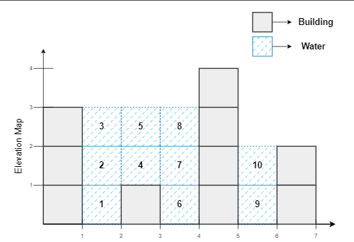

# Trapping Rain Water

Trapping Rainwater Problem states that given an array of n non-negative integers arr[] representing an elevation map
where the width of each bar is 1, compute how much water it can trap after rain.

### Examples:

Input: arr[] = [3, 0, 1, 0, 4, 0, 2]
Output: 10
Explanation: The expected rainwater to be trapped is shown in the above image.

Input: arr[] = [3, 0, 2, 0, 4]
Output: 7
Explanation: We trap 0 + 3 + 1 + 3 + 0 = 7 units.

Input: arr[] = [1, 2, 3, 4]
Output: 0
Explanation: We cannot trap water as there is no height bound on both sides

Input: arr[] = [2, 1, 5, 3, 1, 0, 4]
Output: 9
Explanation : We trap 0 + 1 + 0 + 1 + 3 + 4 + 0 = 9 units of water. 